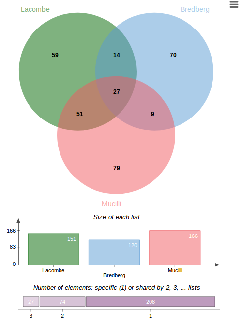
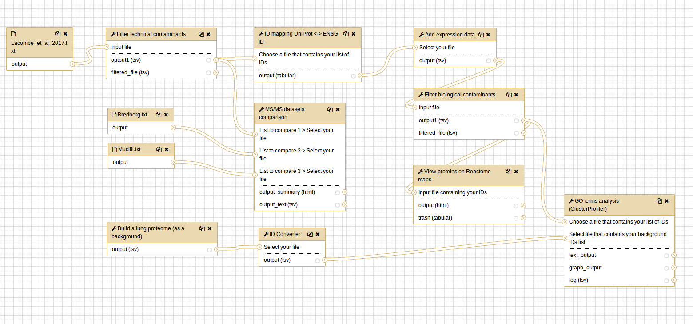

# Introduction
{:.no_toc}

[ProteoRE Galaxy instance](http://www.proteore.org) provides necessary tools to execute a whole annotation pipeline of a protein list identified by LC-MS/MS experiments. This tutorial introduces these tools and guides you through a simple pipeline using some example datasets based on the following study: [Proteomic characterization of human exhaled breath condensate](https://www.ncbi.nlm.nih.gov/pubmed/29189203) by Lacombe *et al., European Journal of Breath, 2018*. 

# Input datasets
{:.no_toc}

**Create a new history** and give it a name.


For this tutorial, we will use three datasets, the list of proteins identified by LC-MS/MS in the exhaled breath condensate (EBC) from Lacombe *et al.* and two others EBC proteomes previously published:

> ### Inputs
> - Lacombe *et al.*
> - Mucilli *et al.*
> - Bredberg *et al.*
{: .hands_on}

> ###  Tip: Importing data from a data library
>
> As an alternative to uploading the data from a URL or your computer, the files are also available via the shared data library from ProteoRE:
>
> * On **proteore.org**, go into **Shared data** (top panel) then **Data libraries**
> * Find the **Proteore** folder
> * Select the desired files (*Lacombe_et_al_2017.txt*, _Bredberg.txt_ and _Mucilli.txt_)
> * Click on the **To History** button near the top and select **"as Datasets"** from the dropdown menu
> * In the pop-up window, select the history you want to import the files to (or create a new one)
> * Click on **Import**
{: .tip}

# Methods
{:.no_toc}

Once identified and/or quantified using a MS-based approach, interpreting the proteome in a sample is an important step to characterize its content in terms of functional properties in order to extend the biological knowledge related to this sample. In this tutorial, we illustrate the annotation and the exploration of the EBC proteome by performing the following steps:

> ### Table of contents
> 1. TOC
> {:toc}
{: .agenda}

# Filtering out technical contaminants

A group of 10 proteins were identified in both “technical” control samples with an enrichment in EBC samples below a fixed threshold. These proteins were thus considered to be technical contaminants (see list of proteins in Table 4 in [_Lacombe et al. 2018_](https://www.ncbi.nlm.nih.gov/pubmed/29189203)) and have to be removed from the initial dataset.

> ###  Filter by keywords and/or numerical value
> 1. From **Tool Panel** choose **ProteoRE** > **Data Manipulation** > **Filter by keywords or numerical value** tool.
> 2. In **Input** file parameter, select **_Lacombe_et_al_2017.txt_**. Keep default option **Yes** for header parameter.
> 3. Select **'Discard'** option in **Operation** parameter. We want to remove technical contaminants.
> 4. Keep the **"OR"** option (by default) for the **operator** parameter. We don't need that parameter for a single filter.
> 3. Click **Insert Filter by keywords** box to add the list of keywords to be filtered out. In this case, keywords are list of Uniprot accession numbers.
> 4. Fill in the parameters in **Filter by keywords** section:
>     - The column of the input dataset on which the filter will be apply, in this case is the column that contains Uniprot accession numbers (c1 as by default).
>     - You can perform exact or partial match with the keywords entered. Partial match is set by default. We keep default option (No) in this tutorial.
>     - You can either copy and paste list of keywords to text area or choose a file that contains keywords in text format, in which each lines contains a keyword. Here we choose to copy and paste the following list of Uniprot accession number:
>         * P04264 P35908 P13645 Q5D862 Q5T749 Q8IW75 P81605 P22531 P59666 P78386 
> 5. Then click on the **'Execute'** button
> 
> > ### Outputs
> > - **Filtered_Lacombe_et_al_2017.txt - Discarded_lines**: output list with the ten proteins (contaminants) removed from the original dataset (10 proteins)
> > - **Filtered_Lacombe_et_al_2017.txt**: output contains the remaining proteins that will be considered for further analysis (151 proteins)
>{: .comment}
{:.hands_on}

# Check for the presence of biological contaminants

As EBC samples are obtained from air exhaled through the oral cavity, and even though the RTube collection device contained a saliva trap to separate saliva from the exhaled breath, contamination with salivary proteins had to be assessed. We decided to check the expression pattern for each protein of the "core" EBC proteome using the Human Protein Atlas (HPA). As HPA is indexed by Ensembl gene identifier (ENSG) we first need to convert Uniprot ID to Ensembl gene (ENSG). Secondly, check for proteins which are highly expressed in the salivary glands as reported by HPA, then in a third step, we filter out these proteins.

> ###  1. Convert Uniprot ID to Ensembl gene
> 1. From Tool Panel choose **ProteoRE** > **Data Manipulation** > **ID Converter** tool.
> 2. In section Provide your identifiers, option **Input file** containing your identifiers is chosen by default. Select input file and set its parameters as following:
>     - **Input file**: Filter_by_keywords_or_numerical_value_on_Lacombe_et_al_2017.txt
>     - **Does your input contain header**: Yes
>     - **Column number of IDs to map**: c1
> 3. Set the Source type and Target type(s) of ID to map.
>     - Select **species**: Human (Homo sapiens)
>     - Select **type/source of identifiers** of your list: Uniprot accession number
>     - **Target type** of IDs: Ensembl gene ID
> 4. Then click on the **'Execute'** button.
>
> >### Outputs 
> > - **ID Converter on data 4**: In this file, a new column which contains Ensembl IDs was added.
>{: .comment}
{:.hands_on}

> ###  2. Check for proteins highly expressed in salivary glands
>
> 1. From Tool Panel choose **ProteoRE** > **Human annotation** > **Add expression data** tool.
> 2. In section Enter your list of Ensembl gene ID, option Input file containing your identifiers is chosen by default. Select input file and set its parameters as following:
>     - **Input file**: output of ID Converter step ID Converter on data 4
>     - The **column number**: c4
>     - Does your input contain **header**: Yes
> 3. Numerous information can be extracted from the HPA source files, you can read user documentation at the end of the submission form of the tool for more detailed description. In this tutorial, we select 
>     - **Gene name**
>     - **Gene description**
>     - **RNA tissue category (according to HPA)**
>     - **RNA tissue specificity abundance in "Transcript Per Million"**.
> 4. Then click on the **'Execute'** button.
>
> > ### Outputs
> > - **Add expression data on data 6**: Four columns were added (n°5, 6, 7 and 8) corresponding to the HPA information previously selected.
> {: .comment}
>
> > ###  Comments
> > Scroll down the table, note at the end of the list (column n°8), that **AMY1B**, **CALML5**, **PIP**, **ZG16B**, **CST4**, **MUC7**, **CST1** and **CST2** have been reported as highly enriched in salivary gland with elevated RNA transcript specific TPM value for each, suggesting that these proteins may come from the saliva and not from the exhaled breath condensate. We thus will removed these biological contaminants from our initial protein set.
> {: .comment}
{:.hands_on}

> ###  3. Filter out the contaminants
> 1. Again from Tool Panel, choose **ProteoRE** > **Data Manipulation** > **Filter by keywords and/or numerical value** tool.
> 2. In Input file parameter, select **Add expression data on data 6**. Keep default option Yes for header parameter.
> 3. Select 'Discard' option in Operation parameter. We want to remove technical contaminants.
> 4. Keep the "OR" option (by default) for the operator parameter. We don't need that parameter for a single filter.
> 3. Click **Insert Filter by keywords** box to add the list of keywords to be filtered out. In this step, we will filter out the lines that contain "salivary" in the column of RNA transcript specific TPM.
> 4. Fill in the parameters in Filter by keywords section:
>     - **column number**: c8 (the column of RNA transcript specific TPM)
>     - **search for exact match**: No (You can perform exact or partial match with the keywords entered. Partial match is set by default.)
>     - **Enter keywords**: copy/paste (You can either copy and paste list of keywords to text area or choose a file that contains keywords in text format, in which each lines contains a keyword. )
>     - **Copy/paste keywords to be filtered out**: "salivary" 
> 5. Then click **'Execute'** button.
>
> > ### Outputs
> > Two output files are created:
> > - **Filtered Add expression data on data 6 - Discarded lines** (12 proteins)
> > - **FilteredAdd expression data on data 6** (151 proteins)
> {: .comment}
>
> > ###  Tip
> > Note also that a list of “gene” may have been entered (selected on the basis of their TPM value) applied to column n°5 instead of the keywords "salivary" to column n°8, as it has been done in [_Lacombe et al, 2018_](https://www.ncbi.nlm.nih.gov/pubmed/29189203).
> {: .tip}
{:.hands_on}

# Functional annotation of the EBC proteome (enrichment analysis)

The resulting list of 151 proteins identified in the two pooled EBC samples (excluding the 10 contaminants proteins) is now submitted to Gene Ontology (GO)-term enrichment analysis to determine functions that were significantly enriched in our EBC proteomic dataset compared to the lung proteome (corresponding to tissue-specific genes extracted from the Human Protein Atlas). To do so, we first build a lung reference proteome (that should be more representative of the studied sample rather than a full human proteome) that will be used for enrichment analysis performed with the ClusterProfiler tool (based on the R package clusterProfiler)

> ###  1. Build a lung reference proteome as a background: Build tissue-specific expression dataset
> 1. From Tool Panel, choose **ProteoRE** > **Human annotation** > **Build tissue-specific expression dataset** tool.
> 2. Set parameters as following: 
>     - **Experimental data source (antibody- or RNAseq-based)**: retrieve information based on immunohistochemistry (default param)
>     - **Tissue**: Dropdown menu allows to select tissue of interest among a list of 58 tissues
>         * Lung
>         * Bronchus
>     - **Expression level**: Ranges from High to Not detected (according to HPA criteria)
>         * High
>         * Medium
>         * Low
>     - **Reliability score**: indicates how reliable the expression/detection level is; here we select “Enhanced” and “Supported” which are the most reliable score according to HPA; for a more detailed description, read user documentation at the end of the submission form of this tool.
>         * Enhanced
>         * Supported
> 5. Then click on the **'Execute'** button
>
> > ### Output
> > - 'Tissue-specific_expression_from_IHC'
>{: .comment}
>
> > ###  Tip
> > Note that expression information about respiratory cell types is retrieved (column 4; e.g. macrophages, pneumocytes, respiratory epithelial cells) that could be used for further refinement of your reference background.
> {: .tip}
{:.hands_on}

> ###  2. Build a lung reference proteome as a background: Convert Ensembl gene ID to Uniprot and Entrez gene ID
> As the ClusterProfiler tool (we are going to use for the enrichment analysis) does not consider ENSG (Ensembl gene) identifiers as input, we need to convert these IDs into either entrez gene ID or Uniprot accession number that are compliant with. 
>
> 1. From Tool Panel choose **ProteoRE** > **Data Manipulation** > **ID Converter** tool.
> 2. Set input parameters:
>     - **Input file**: Build tissue-specific expression dataset
>     - **Does your input contain header**: Yes
>     - **Column number**: c1
> 3. Set source and target ID type:
>     - **Select type/source of identifier of your list**: Ensembl gene ID
>     - **Target type of IDs**: Uniprot accession number and Entrez gene ID
> 4. Then click on the **'Execute'** button. 
>
> > ### Output
> > Two new columns have now been added to input file:
> > - 'ID Converter on data 11'
>{: .comment}
{:.hands_on}

> ###  3. Functional analysis using "GO terms classification and enrichment analysis"
> 1. From Tool Panel choose **ProteoRE** > **Go terms analysis** > **GO terms classification and enrichment analysis** tool.
> 2. Set input parameters:
>     - **Input file**: the EBC proteome to be analyzed after technical and biological contaminants removal which is the output of biological contaminants filter step.
>     - **Header**: Yes
>     - **Column number**: c1
> 3. Set **source/type*** of input IDs: Uniprot Accession number
> 4. Set **species**: Human
> 5. Set **GO categories**: select all three options
>     - Cellular component
>     - Biological Process
>     - Molecular Function
> 5. **Perform GO categories representation analysis parameters**: Yes
>      - Level of ontology: 3
> 6. **Perform GO categories enrichment analysis parameter**: Yes
>      - **P-value cut off**: 0.01
>      - **Q-value cut off**: 0.05
> 7. **Define your own background IDs**: Yes
>      - **Input file**: lung proteome we previously build.Header: Yes
>      - **Column number**: c7
>      - Select **type of background IDs**: Uniprot Accession number
> 8. **Graphical display**: dot-plot
> 9. Then click on the **'Execute'** button.
>
> > ### Outputs
> > Results created in History panel are the following:
> > - **Cluster profiler** (text file)
> > - **ClusterProfiler diagram outputs** (collection dataset of all graphical outputs)
> > - **ClusterProfiler text files** (collection dataset of all text files)
> {: .comment}
>
> > ###  Comments
> > The suffix "GGO" (GroupGO) corresponds to the results "GO categories representation analysis" option (performs a gene/protein classification based on GO distribution at a specific level) while the suffix "EGO" (EnrichGO) corresponds to the results from the enrichment analysis (based on an over-representation test of Go terms against the lung reference background). Two type of graphical output are provided either in the form of bar-plot or dot-plot.
> >   
> > According to this analysis, the main biological processes we found over-represented in EBC compared to lung, were some processes related to the immune system and exocytosis (see EGO.BP.dot.png, for Enriched Biological Process GO terms dot-plot representation in png format).
>{: .comment}
{:.hands_on}

# Visualize EBC proteome on biological pathways (using Reactome)

The 151 proteins identified in EBC samples are now mapped to biological pathways and visualized via the web service of Reactome, an open access, manually curated and peer-reviewed human pathway database that aims to provide intuitive bioinformatics tools for the visualization, interpretation and analysis of pathway knowledge.

> ###  Reactome
> 1. From Tool Panel choose **ProteoRE** > **Pathway Analysis** > **Query pathway database [Reactome]** tool.
> 2. Set input parameters:
>     - **Input file**: the EBC proteome to be analyzed after the removal technical and biological contaminants
>     - **Header**: Yes
>     - **Column number**: c1
> 3. Then click ont the **'Execute'** button.
>
> > ### Output 
> > - Query pathway database on data 8
> > 
> > 
> {: .comment}
>
> > ### Comments
> > From History Panel, click View data button of the new output to display access to Reactome in the central panel. Click the Analyse button to display the Reactome analysis tools page via the web service and display the results. Browse biological patwhays in which EBC proteins are highlighted (e.g. immune system pathways) using Reactome interface functionalities.
> {: .comment}
{:.hands_on}

# Comparison with other proteomic datasets from previous studies

Our experimental design and the dataset produced (i.e. the list of 151 proteins identified in both pooled EBC samples including the 10 salivary proteins) were compared to the two most extensive EBC proteome maps previously described for healthy subjects (_Mucilli et al., 2015_ ; _Bredberg et al., 2012_). To do so, a Venn diagram showing the overlap between our dataset and the two previous EBC characterizations in healthy donors is drawn using the Venn diagram tool from ProteoRE.

> ###  Venn diagram
> 1.  From Tool Panel choose **ProteoRE** > **Data Manipulation** > **Venn diagram** tool.
> 2. Set first input (our EBC sample) parameters:
>     - **Input file**: The EBC proteome to be analyzed after technical contaminants removal (BEFORE biological contaminants removal) - Filter by keywords or numerical value on Lacombe_et_al_2017.txt
>     - **Header**: Yes
>     - **Column number**: c1
>     - **Name of the list**: Lacombe et al
> 3. Set second input (sample from Bredberg's study) parameters:
>     - **Input file**: Bredberg.txt
>     - **Header**: No
>     - **Column number**: c1
>     - **Name of the list**: Bredberg et al
> 4. Set third input (sample from Mucilli's study) parameters:
>     - **Input file**: Mucilli.txt
>     - **Header**: No
>     - **Column number**: c1
>     - **Name of the list**: Mucilli et al
> 5. Then click on the **'Execute'** button.
>
> > ### Output.
> > - **Venn diagram text output**
> > - **Venn diagram**
> > 
> > From the Venn diagram, we can see the number of proteins that is common/unique for each list combination. 
> {: .comment}
{:.hands_on}

# Workflow 

A workflow is available to do this tutorial, you can find it in the tutorial available on proteore.org:
[_Annotating a protein list identified by LC-MS/MS experiments_](http://www.proteore.org/u/proteore/p/proteore-tutorial-1-release-1-2)

